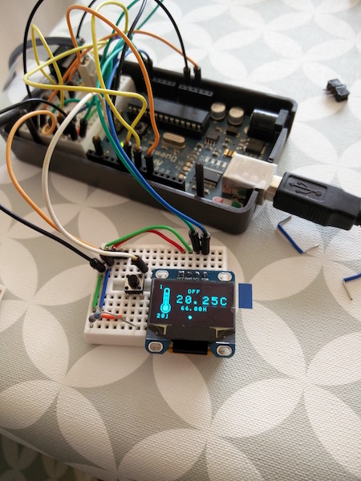
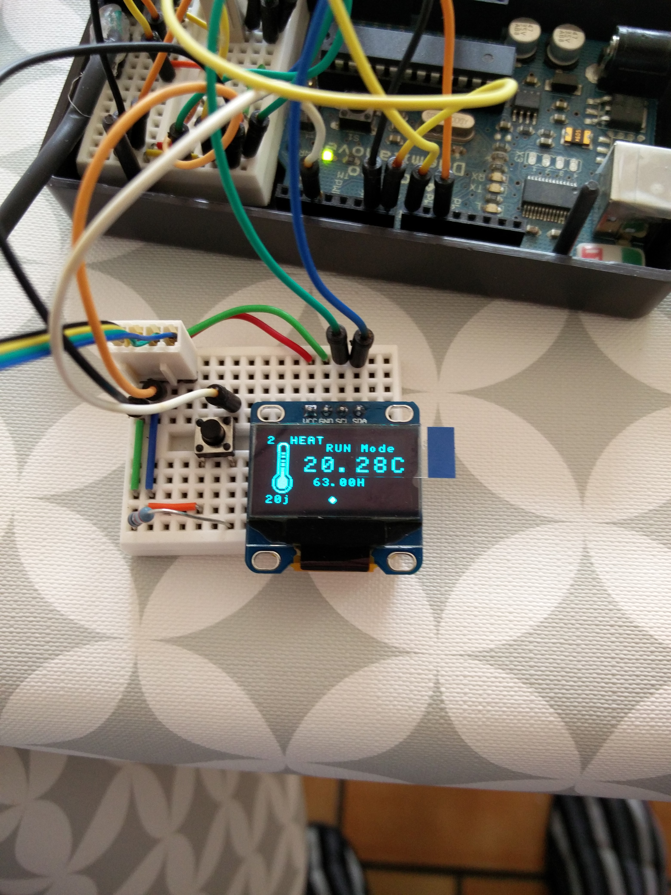
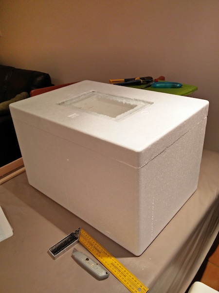

#AUTOMATED EGG INCUBATOR

This is a fully automated egg incubator based on Arduino.

It basically measure:
- Temperature
- Humidity

It pilots 2 relays:
- Lamp to heat the eggs
- A motor to roll the eggs every 3 hours.

It displays the information on a lovely tiny OLED screen!

