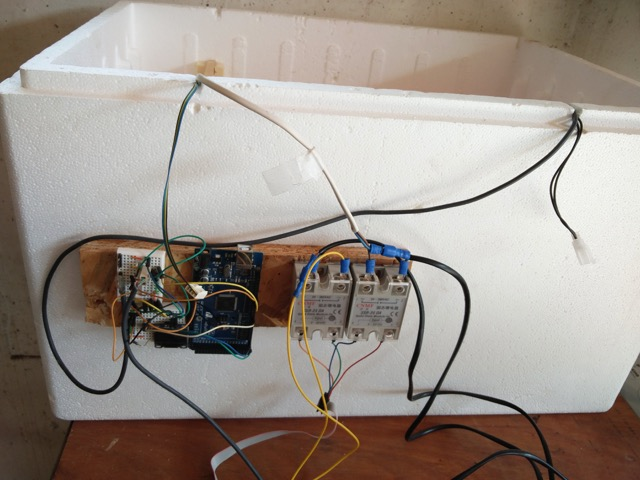
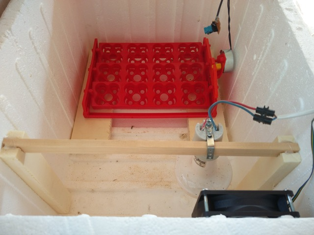

# Egg incubator V2 - 2017

## Overview

The goal is to enhance 2016 version with the follozing setup:

### Hardware
- Arduino Mega
- OLED screen SSD1306
- DS18B20 x 2
- DHT11
- Relay SSR x 2 (silence is king)
- Fan
- Microwave motor

### Software
- PID controller
- OLED driver

### Build

