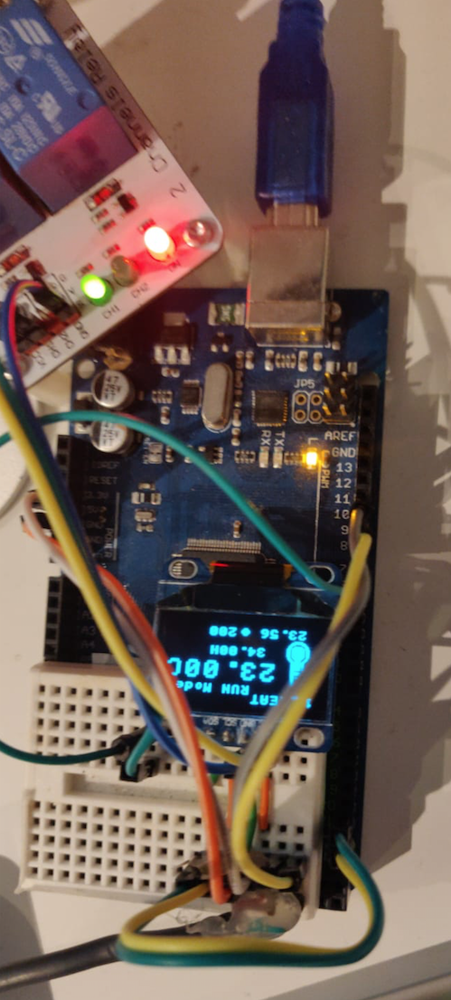

# Serre - Project for raising peppers on a secured environment

## Overview

Raising pepper plants from seeds to plant inside when the weather is not kind enough.

The usual suspects:
- Arduino
- LCD screen
- DHT-11
- DS18B20
- Relay
- 12V Heater
- Regulator Power 12V

The less frequent items:
- Fish tank
- Sand
- Pepper seeds

